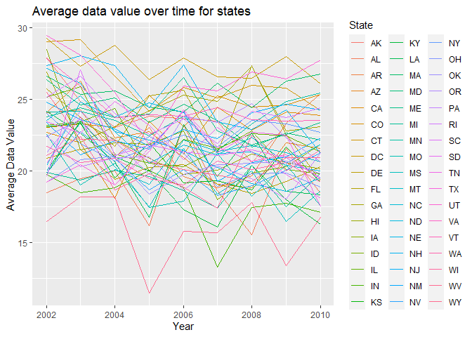

Homework 3
================
Kelvin Delali Tamakloe
10/20/2021

``` r
library(tidyverse)
```

    ## -- Attaching packages --------------------------------------- tidyverse 1.3.1 --

    ## v ggplot2 3.3.5     v purrr   0.3.4
    ## v tibble  3.1.4     v dplyr   1.0.7
    ## v tidyr   1.1.3     v stringr 1.4.0
    ## v readr   2.0.1     v forcats 0.5.1

    ## -- Conflicts ------------------------------------------ tidyverse_conflicts() --
    ## x dplyr::filter() masks stats::filter()
    ## x dplyr::lag()    masks stats::lag()

``` r
library(dplyr)
library(p8105.datasets)
library(janitor)
```

    ## 
    ## Attaching package: 'janitor'

    ## The following objects are masked from 'package:stats':
    ## 
    ##     chisq.test, fisher.test

``` r
library(readr)
```

# Question 1

## Instacart Dataset Exploration

Below, we will explore the instacart dataset

``` r
data("instacart")
```

Brief Description:

Instacart is an American grocery delivery and pick up service company.

The `instacart` dataset has data from the year 2017. There are 1384617
observations and 15 variables.

In this dataset, the the total number of data points is 20769255. There
are some key variables in this dataset including order\_id, product\_id,
add\_to\_cart\_order, reordered, user\_id, eval\_set, order\_number,
order\_dow, order\_hour\_of\_day, days\_since\_prior\_order,
product\_name, aisle\_id, department\_id, aisle, department.

## Total number of aisles and aisles from which the most items are ordered

The code below will tell us how many aisles there are, and from which
aisles the most items are ordered.

``` r
instacart %>% 
    count(aisle) %>% 
    arrange(desc(n))
```

    ## # A tibble: 134 x 2
    ##    aisle                              n
    ##    <chr>                          <int>
    ##  1 fresh vegetables              150609
    ##  2 fresh fruits                  150473
    ##  3 packaged vegetables fruits     78493
    ##  4 yogurt                         55240
    ##  5 packaged cheese                41699
    ##  6 water seltzer sparkling water  36617
    ##  7 milk                           32644
    ##  8 chips pretzels                 31269
    ##  9 soy lactosefree                26240
    ## 10 bread                          23635
    ## # ... with 124 more rows

There are a total 134 `aisles`. The aisles from which the most items are
ordered are `fresh vegetables`, `fresh fruits`, and
`packaged vegetables fruits` in that order.

## Plot of number of items ordered per aisle (&gt; 10000 items ordered)

The code below generates a plot of the number of items ordered in each
aisle but limited to aisles with more than 10000 orders.

``` r
instacart %>%
  count(aisle) %>%
  filter(n > 10000) %>%
  ggplot(aes(forcats::fct_reorder(aisle, (n)), n)) +
  geom_col() +
  coord_flip() +
  labs(
    title = "Number of items ordered per aisle",
    x = "Aisle name",
    y = "Number of items ordered",
    caption = "Data from instacart limited to aisles with more than 10,000 items ordered"
  )
```

<!-- -->

## Table showing three most popular items in selected aisles

The code below produces a table showing the three most popular items in
each of the aisles “baking ingredients”, “dog food care”, and “packaged
vegetables fruits”,with information on the number of items ordered.

``` r
instacart %>%
  filter(aisle == "baking ingredients" | 
           aisle == "dog food care" | 
           aisle == "packaged vegetables fruits") %>%
 count(aisle, product_name) %>%
  arrange(desc(n)) %>%
  group_by(aisle) %>%
  slice(1:3) %>%
  arrange(desc(n)) %>%
  group_by(aisle) %>%
  knitr::kable(caption = "Three Most Ordered Items Per Aisle")
```

| aisle                      | product\_name                                 |    n |
|:---------------------------|:----------------------------------------------|-----:|
| packaged vegetables fruits | Organic Baby Spinach                          | 9784 |
| packaged vegetables fruits | Organic Raspberries                           | 5546 |
| packaged vegetables fruits | Organic Blueberries                           | 4966 |
| baking ingredients         | Light Brown Sugar                             |  499 |
| baking ingredients         | Pure Baking Soda                              |  387 |
| baking ingredients         | Cane Sugar                                    |  336 |
| dog food care              | Snack Sticks Chicken & Rice Recipe Dog Treats |   30 |
| dog food care              | Organix Chicken & Brown Rice Recipe           |   28 |
| dog food care              | Small Dog Biscuits                            |   26 |

Three Most Ordered Items Per Aisle

From the table, `organic baby spinach`, `organic raspberries`, and
`organic blueberries` are the three most ordered items from the
`packaged vegetables fruits` aisle.

Also, `light brown sugar`, `pure baking soda`, and `cane sugar` are the
three most ordered items from the `baking ingredients` aisle.

The three most ordered items from the `dog food care` aisle are
`snack sticks chicken & rice recipe dog treats`,
`organix chicken & brown rice recipe`, and `small dog biscuits`.

## Table showing the mean hour of the day at which Pink Lady Apples and Coffee Ice Cream are ordered on each day of the week.

``` r
 instacart %>% 
    filter(product_name %in% c("Pink Lady Apples", "Coffee Ice Cream")) %>% 
    group_by(product_name, order_dow) %>% 
    summarize(mean_hour = mean(order_hour_of_day)) %>% 
    pivot_wider(
        names_from = order_dow,
        values_from = mean_hour
  ) %>%
  rename( "Sunday" = "0","Monday" = "1", "Tuesday" = "2", "Wednesday" = "3", "Thursday" = "4", "Friday" = "5", "Saturday" = "6") %>% 
  knitr::kable(caption = "Mean Hour of Day Ordered")
```

    ## `summarise()` has grouped output by 'product_name'. You can override using the `.groups` argument.

| product\_name    |   Sunday |   Monday |  Tuesday | Wednesday | Thursday |   Friday | Saturday |
|:-----------------|---------:|---------:|---------:|----------:|---------:|---------:|---------:|
| Coffee Ice Cream | 13.77419 | 14.31579 | 15.38095 |  15.31818 | 15.21739 | 12.26316 | 13.83333 |
| Pink Lady Apples | 13.44118 | 11.36000 | 11.70213 |  14.25000 | 11.55172 | 12.78431 | 11.93750 |

Mean Hour of Day Ordered

Generally, `Pink Lady Apples` are ordered earlier in the day than
`Coffee Ice Cream`.

# Question 2

The code below will clean the `brfss_smart2010` data: formatting it to
use appropriate variable names, focusing on the `Overall Health` topic,
and only including factored responses ordered from`Poor` to `Excellent`.

``` r
data("brfss_smart2010")
brfss_cleaned_version = brfss_smart2010 %>% 
  janitor::clean_names() %>%
  filter(topic %in% c("Overall Health")) %>%
  mutate(response = factor(response, levels = c("Poor", "Fair", "Good", "Very good", "Excellent"))) %>%
  arrange(response) %>%
  filter(response %in% c("Excellent", "Very good", "Good", "Fair", "Poor")) %>%
  separate(locationdesc, into = c('state', 'location'), sep = ' - ')
```

## 2002: States observed at 7 or more locations

The code below will provide information on which states were observed at
7 or more locations in 2002.

``` r
states_2002 = brfss_cleaned_version %>% 
  filter(year == "2002") %>% 
  group_by(state) %>% 
  distinct(location) %>% 
  count(state) %>% 
  filter(n >= 7) %>% 
  select(state)
```

## 2010: States observed at 7 or more locations

The code below will provide information on which states were observed at
7 or more locations in 2002.

``` r
states_2010 = brfss_cleaned_version %>% 
  filter(year == "2010") %>% 
  group_by(state) %>% 
  distinct(location) %>% 
  count(state) %>% 
  filter(n >= 7) %>% 
  select(state)
```

In 2002, the states that were observed at 7 or more locations were CT,
FL, MA, NC, NJ, PA. In 2010, the states that were observed at 7 or more
locations were CA, CO, FL, MA, MD, NC, NE, NJ, NY, OH, PA, SC, TX, WA.

## Plot of Excellent responses

The code below will construct a dataset that is limited to Excellent
responses, and contains, year, state, and a variable that averages the
data\_value across locations within a state. Furthermore, the code will
make a “spaghetti” plot of this average value over time within a state

``` r
Excellent_df = brfss_cleaned_version %>%
  filter(response %in% "Excellent") %>%
  select(year, locationabbr, data_value) %>%
  unique() %>%
  na.omit() %>%
  group_by(locationabbr, year) %>%
  mutate(
    avg_data_value = mean(data_value)) %>%
  select(year, locationabbr, avg_data_value) %>%
  distinct()
Excellent_df %>%
  ggplot(aes(x = year, y = avg_data_value)) +
  geom_line(aes(group = locationabbr, color = locationabbr)) +
  labs(
    title = "Average data value over time for statess",
    x = "Year",
    y = "Average Data Value") +
  guides(col = guide_legend("State")) +
  theme(legend.position = "right")
```

<!-- -->

## 2006/2010 Two-panel Plot of data\_value distribution for Poor to Excellent responses in NY State location

The code below will make a two-panel plot showing, for the years 2006,
and 2010, distribution of data\_value for responses (“Poor” to
“Excellent”) among locations in NY State.

``` r
brfss_panels = brfss_cleaned_version %>% 
  filter(year %in% c(2006,2010),
  state == "NY") 
ggplot(brfss_panels, aes(x = response, y = data_value, fill = response)) + 
  geom_boxplot() + 
  facet_grid(. ~ year) +
  labs(
    title = "Distribution of data_value for responses in NY",
    x = "Response",
    y = "data_value",
    caption = "Data from the brfss dataset"
  )
```

<!-- -->
